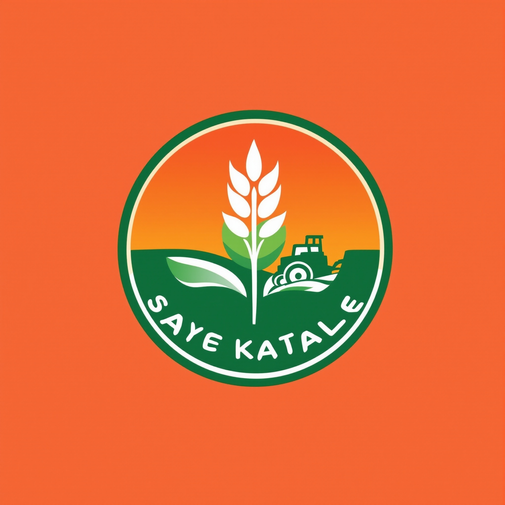
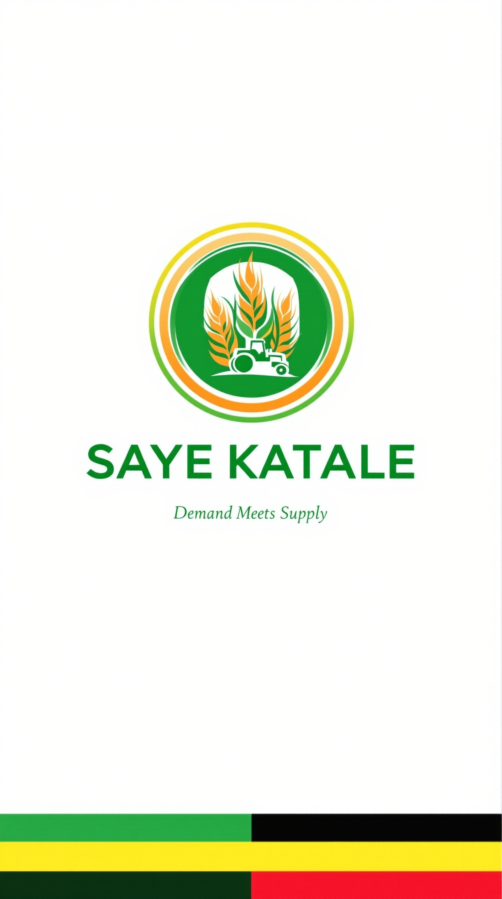

# 📦 SayeKatale Branding Assets

## Quick Access to Logo Files

### 🎨 Available Assets

#### 1. **Full Logo with Text**


**File:** `sayekatale_logo_full.jpg`  
**Size:** 2048x2048px (310.54 KB)  
**Format:** JPEG  
**Use for:** Marketing, presentations, website, business cards

---

#### 2. **App Icon (Square)**


**File:** `sayekatale_app_icon.jpg`  
**Size:** 2048x2048px (421.31 KB)  
**Format:** JPEG  
**Use for:** Mobile app icon, favicon, social media profiles

---

#### 3. **Splash Screen Design**


**File:** `sayekatale_splash_screen.jpg`  
**Size:** 1536x2752px (274.78 KB)  
**Format:** JPEG (9:16 vertical)  
**Use for:** App splash screen, loading animation background

---

## 📥 Download Instructions

### Option 1: Direct File Access
All files are located in this directory:
```
/home/user/flutter_app/branding/
```

### Option 2: Individual Downloads
Navigate to each file and download:
- `sayekatale_logo_full.jpg` - Full logo
- `sayekatale_app_icon.jpg` - App icon
- `sayekatale_splash_screen.jpg` - Splash screen

### Option 3: Bulk Download (Recommended)
Download all branding assets as a package (see instructions below)

---

## 🎨 Quick Brand Reference

### Colors
- **Green:** #4CAF50 (Primary - Agriculture)
- **Orange:** #FF9800 (Energy & Growth)
- **Blue:** #2196F3 (Trust)

### Typography
- **Font:** Roboto (Sans-serif)
- **Logo Text:** Bold, 48px
- **Tagline:** Regular, 18px

### Tagline
**"Demand Meets Supply"**

---

## 📋 Usage Guide

### Full Logo
- Use on white or light backgrounds
- Maintain aspect ratio when scaling
- Minimum size: 48x48px digital, 1 inch print

### App Icon
- Optimized for small sizes
- High contrast for visibility
- Already sized for app stores

### Splash Screen
- Vertical format for mobile apps
- Ready for animation integration
- Clean, professional appearance

---

## 🔄 File Formats

### Current Format: JPEG
- ✅ High quality
- ✅ Good compression
- ✅ Universal support
- ❌ No transparency

### Recommended Conversions
1. **PNG** - For logos with transparent backgrounds
2. **SVG** - For infinite scalability (vector)
3. **ICO** - For website favicons

---

## 📱 App Integration Status

### Current Implementation
✅ Animated splash screen with brand elements  
✅ Logo assets ready for download  
✅ Color scheme implemented in app theme  
✅ Typography guidelines followed  

### Recommended Next Steps
- Convert JPEG to PNG (transparency support)
- Create SVG versions (scalability)
- Generate app icon sizes for all platforms
- Update splash screen with static logo option

---

## 🌐 Online Versions

The logo images are also available at these URLs:

**Full Logo:**
https://cdn1.genspark.ai/user-upload-image/5_generated/ac70d928-7d49-4f0b-9406-e81666b4845d.jpeg

**App Icon:**
https://cdn1.genspark.ai/user-upload-image/5_generated/7030c554-4cc1-4d8c-9bdc-e1630a1761e9.jpeg

**Splash Screen:**
https://cdn1.genspark.ai/user-upload-image/5_generated/c543a53b-920c-49ca-8404-67230b3d8bd6.jpeg

*(Note: These are the original generation URLs. Download local copies for production use)*

---

## 📚 Documentation

For complete branding guidelines, see:
- **BRANDING_PACKAGE.md** - Comprehensive brand guide (11,767 characters)

Contents include:
- Logo usage guidelines
- Color palette specifications
- Typography rules
- Marketing material templates
- Brand voice & messaging
- Digital presence guidelines
- File format recommendations

---

## ✅ Quality Checklist

Before using assets in production:

- [ ] Downloaded all three logo files
- [ ] Converted to PNG (if transparency needed)
- [ ] Created SVG versions (if scalability needed)
- [ ] Generated app icon sizes (iOS & Android)
- [ ] Tested on various backgrounds
- [ ] Verified color accuracy
- [ ] Checked minimum size requirements
- [ ] Reviewed brand guidelines

---

## 🎯 Quick Reference

**App Name:** SAYE KATALE  
**Tagline:** Demand Meets Supply  
**Industry:** Agricultural Marketplace  
**Location:** Uganda  
**Platform:** Mobile (iOS/Android) + Web  

**Primary Use Cases:**
- PSA (Primary Service Agents) - Agricultural suppliers
- SHG (Self-Help Groups) - Farmer cooperatives  
- SME (Small-Medium Enterprises) - Buyers

---

## 📞 Support

For questions about branding assets or additional design needs:
- Refer to BRANDING_PACKAGE.md for detailed guidelines
- Check app theme colors in `/lib/utils/app_theme.dart`
- Review splash animation in `/lib/screens/splash_screen.dart`

---

## 🚀 Ready for Production

All branding assets are production-ready and can be used immediately for:
- App store submissions
- Marketing campaigns
- Social media presence
- Business materials
- Website development
- Merchandise design

**Download your logos and start branding! 🌾**
